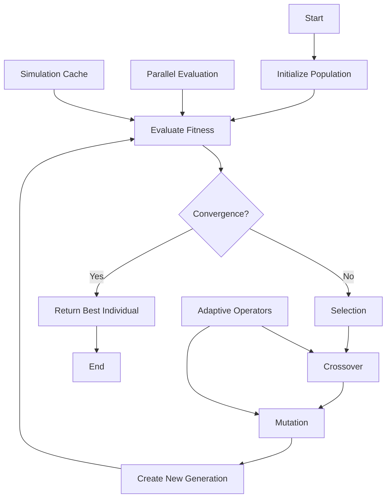

# Genetic Algorithm Architecture for Buck Converter Parameter Optimization

## 1. Executive Summary

This document provides a comprehensive architectural design for a genetic algorithm (GA) to optimize Buck Converter simulation parameters by minimizing the difference between simulated and measured data. The GA will optimize 7 key circuit parameters to achieve the best match across 4 fitness metrics.

## 2. Parameter Encoding Scheme

### 2.1 Parameters to Optimize

| Parameter           | Current Value | Min Bound | Max Bound | Scale  | Gene Index |
| ------------------- | ------------- | --------- | --------- | ------ | ---------- |
| Gate Rise Time (ns) | 1             | 0.1       | 100       | log    | 0          |
| Gate Fall Time (ns) | 1             | 0.1       | 100       | log    | 1          |
| Switch Ron (Ω)      | 1e-9          | 1e-12     | 1e-3      | log    | 2          |
| Diode Rs (Ω)        | 1e-4          | 1e-6      | 0.1       | log    | 3          |
| Diode Is (A)        | 1e6           | 1e-15     | 1e10      | log    | 4          |
| Capacitor ESR (Ω)   | 0.05          | 0.001     | 0.5       | linear | 5          |
| Capacitor L (H)     | 1e-9          | 1e-12     | 1e-7      | log    | 6          |

### 2.2 Genome Representation

```python
class Genome:
    """
    Real-valued encoding with normalized genes [0, 1]
    Actual values computed using scaling functions
    """
    def __init__(self):
        self.genes = np.random.rand(7)  # 7 parameters (L resistance removed)

    def get_actual_values(self):
        """Convert normalized genes to actual parameter values"""
        params = {}

        # Logarithmic scaling for wide-range parameters
        params['gate_rise_ns'] = 10**(np.log10(0.1) + self.genes[0] * (np.log10(100) - np.log10(0.1)))
        params['gate_fall_ns'] = 10**(np.log10(0.1) + self.genes[1] * (np.log10(100) - np.log10(0.1)))
        params['switch_ron'] = 10**(np.log10(1e-12) + self.genes[2] * (np.log10(1e-3) - np.log10(1e-12)))
        params['diode_rs'] = 10**(np.log10(1e-6) + self.genes[3] * (np.log10(0.1) - np.log10(1e-6)))
        params['diode_is'] = 10**(np.log10(1e-15) + self.genes[4] * (np.log10(1e10) - np.log10(1e-15)))
        params['cap_l'] = 10**(np.log10(1e-12) + self.genes[6] * (np.log10(1e-7) - np.log10(1e-12)))

        # Linear scaling for ESR
        params['cap_esr'] = 0.001 + self.genes[5] * (0.5 - 0.001)

        # Fixed parameter (not optimized)
        params['l_resistance'] = 19.5e-3  # Datasheet value

        return params
```

## 3. Fitness Function Design

### 3.1 Multi-Objective Fitness Function

```python
def calculate_fitness(simulation_result, measured_data):
    """
    Composite fitness function with weighted objectives
    Lower values indicate better fitness (minimization problem)
    Ripple matching is emphasized as it's critical for converter behavior
    """

    # Weight factors - ripple metrics are more important
    W_AVG_VOUT = 0.20    # Average voltage matching
    W_RIPPLE_VOUT = 0.35 # Voltage ripple matching (critical)
    W_AVG_IL = 0.15      # Average current matching
    W_RIPPLE_IL = 0.30   # Current ripple matching (critical)

    # Calculate individual fitness components (percentage differences)
    f1 = abs(simulation_result['percentage_difference_avg_vout'])
    f2 = abs(simulation_result['percentage_difference_ripple_vout'])
    f3 = abs(simulation_result['percentage_difference_avg_il'])
    f4 = abs(simulation_result['percentage_difference_ripple_il'])

    # Apply penalty for extreme ripple mismatches (>100% error)
    if f2 > 100:
        f2 *= 1.5  # Penalty multiplier
    if f4 > 100:
        f4 *= 1.5

    # Composite fitness (weighted sum)
    fitness = (W_AVG_VOUT * f1 +
              W_RIPPLE_VOUT * f2 +
              W_AVG_IL * f3 +
              W_RIPPLE_IL * f4)

    # Add regularization term for extreme parameter values
    regularization = calculate_regularization(params)
    fitness += 0.01 * regularization

    return fitness

def calculate_regularization(params):
    """
    Penalize extreme parameter values that are physically unrealistic
    """
    penalty = 0

    # Penalize very high ESR (>0.3Ω is unusual for capacitors)
    if params['cap_esr'] > 0.3:
        penalty += (params['cap_esr'] - 0.3) * 10

    # Penalize very low switch resistance (<1e-9 is unrealistic)
    if params['switch_ron'] < 1e-9:
        penalty += -np.log10(params['switch_ron'] / 1e-9) * 5

    return penalty
```

### 3.2 Alternative: Pareto-Based Multi-Objective Optimization

```python
def calculate_objectives(simulation_result):
    """
    Return individual objectives for Pareto optimization
    """
    return np.array([
        abs(simulation_result['percentage_difference_avg_vout']),
        abs(simulation_result['percentage_difference_ripple_vout']),
        abs(simulation_result['percentage_difference_avg_il']),
        abs(simulation_result['percentage_difference_ripple_il'])
    ])

def dominates(obj1, obj2):
    """Check if obj1 Pareto-dominates obj2"""
    return all(obj1 <= obj2) and any(obj1 < obj2)
```

## 4. GA Hyperparameters and Strategies

### 4.1 Population Parameters

```python
GA_CONFIG = {
    'population_size': 50,      # Balance between diversity and computation
    'num_generations': 100,      # Maximum generations
    'elite_size': 5,            # Best individuals to preserve
    'tournament_size': 3,       # For tournament selection
    'crossover_rate': 0.8,      # Probability of crossover
    'mutation_rate': 0.15,      # Base mutation probability
    'adaptive_mutation': True,   # Enable adaptive mutation rates
    'convergence_patience': 15,  # Generations without improvement
    'convergence_threshold': 0.001,  # Minimum fitness improvement
    'simulation_periods': 200    # Number of PWM periods for steady-state
}
```

### 4.1.1 Simulation Configuration

```python
SIMULATION_CONFIG = {
    'warmup_periods': 200,       # Periods to reach steady-state
    'measurement_periods': 2,    # Periods to match with measured data
    'total_periods': 202,        # Total simulation periods
    'use_initial_conditions': True,  # Use calculated initial conditions
    'parallel_simulations': True,    # Enable parallel evaluation
    'cache_results': True        # Cache simulation results
}
```

### 4.2 Selection Strategy

**Tournament Selection with Elitism:**

```python
def tournament_selection(population, fitness_scores, tournament_size=3):
    """
    Select parent using tournament selection
    """
    tournament_indices = np.random.choice(len(population), tournament_size, replace=False)
    tournament_fitness = fitness_scores[tournament_indices]
    winner_idx = tournament_indices[np.argmin(tournament_fitness)]
    return population[winner_idx]
```

### 4.3 Crossover Strategy

**Simulated Binary Crossover (SBX) for Real-Valued Encoding:**

```python
def sbx_crossover(parent1, parent2, eta=20):
    """
    Simulated Binary Crossover for real-valued genes
    eta controls offspring spread (higher = closer to parents)
    """
    offspring1 = parent1.copy()
    offspring2 = parent2.copy()

    for i in range(len(parent1.genes)):
        if np.random.random() < 0.5:  # 50% chance per gene
            u = np.random.random()

            if u <= 0.5:
                beta = (2 * u) ** (1 / (eta + 1))
            else:
                beta = (1 / (2 * (1 - u))) ** (1 / (eta + 1))

            offspring1.genes[i] = 0.5 * ((1 + beta) * parent1.genes[i] +
                                         (1 - beta) * parent2.genes[i])
            offspring2.genes[i] = 0.5 * ((1 - beta) * parent1.genes[i] +
                                         (1 + beta) * parent2.genes[i])

            # Ensure bounds [0, 1]
            offspring1.genes[i] = np.clip(offspring1.genes[i], 0, 1)
            offspring2.genes[i] = np.clip(offspring2.genes[i], 0, 1)

    return offspring1, offspring2
```

### 4.4 Mutation Strategy

**Adaptive Polynomial Mutation:**

```python
def polynomial_mutation(genome, generation, max_generation, base_rate=0.15):
    """
    Polynomial mutation with adaptive rate
    Rate increases as evolution progresses to escape local optima
    """
    # Adaptive mutation rate
    progress = generation / max_generation
    mutation_rate = base_rate * (1 + progress)  # Increases over time

    eta_m = 20  # Distribution index

    for i in range(len(genome.genes)):
        if np.random.random() < mutation_rate:
            u = np.random.random()

            if u <= 0.5:
                delta = (2 * u) ** (1 / (eta_m + 1)) - 1
            else:
                delta = 1 - (2 * (1 - u)) ** (1 / (eta_m + 1))

            genome.genes[i] += delta
            genome.genes[i] = np.clip(genome.genes[i], 0, 1)

    return genome
```

## 5. Implementation Architecture

### 5.1 Main GA Class Structure

```python
class BuckConverterGA:
    def __init__(self, circuit_params, measured_data, ga_config):
        self.circuit_params = circuit_params
        self.measured_data = measured_data
        self.config = ga_config
        self.population = []
        self.fitness_history = []
        self.best_individual = None
        self.generation = 0

    def initialize_population(self):
        """Create initial population with some seeded individuals"""
        self.population = []

        # Add current parameters as seed
        seed_genome = self.create_seed_genome()
        self.population.append(seed_genome)

        # Add variations of seed
        for _ in range(4):
            varied = self.create_varied_seed(seed_genome)
            self.population.append(varied)

        # Random individuals for diversity
        while len(self.population) < self.config['population_size']:
            self.population.append(Genome())

    def evaluate_population(self):
        """Parallel evaluation using multiprocessing"""
        with multiprocessing.Pool(processes=cpu_count()) as pool:
            fitness_scores = pool.map(self.evaluate_individual, self.population)
        return np.array(fitness_scores)

    def evaluate_individual(self, genome):
        """Evaluate single genome with caching and error handling"""
        try:
            params = genome.get_actual_values()

            # Create modified simulation with extended warmup
            simulation = self.create_simulation(params)

            # Configure simulation for steady-state
            simulation.warmup_periods = SIMULATION_CONFIG['warmup_periods']

            # Run simulation with extended periods
            result = simulation.run_simulation(self.measured_data['time'])

            # Calculate fitness
            comparison = self.compare_results(result, self.measured_data)
            fitness = calculate_fitness(comparison, self.measured_data)

            return fitness

        except Exception as e:
            # Return high penalty for failed simulations
            print(f"Simulation failed: {e}")
            return 1e6

    def evolve(self):
        """Main evolution loop"""
        self.initialize_population()

        no_improvement_count = 0
        best_fitness = float('inf')

        for generation in range(self.config['num_generations']):
            self.generation = generation

            # Evaluate population
            fitness_scores = self.evaluate_population()

            # Track best individual
            best_idx = np.argmin(fitness_scores)
            if fitness_scores[best_idx] < best_fitness - self.config['convergence_threshold']:
                best_fitness = fitness_scores[best_idx]
                self.best_individual = self.population[best_idx].copy()
                no_improvement_count = 0
            else:
                no_improvement_count += 1

            # Check convergence
            if no_improvement_count >= self.config['convergence_patience']:
                print(f"Converged at generation {generation}")
                break

            # Create next generation
            self.population = self.create_next_generation(fitness_scores)

            # Log progress
            self.log_generation(generation, fitness_scores)

        return self.best_individual

    def create_next_generation(self, fitness_scores):
        """Generate next population using genetic operators"""
        next_population = []

        # Elitism: preserve best individuals
        elite_indices = np.argsort(fitness_scores)[:self.config['elite_size']]
        for idx in elite_indices:
            next_population.append(self.population[idx].copy())

        # Generate offspring
        while len(next_population) < self.config['population_size']:
            # Selection
            parent1 = tournament_selection(self.population, fitness_scores)
            parent2 = tournament_selection(self.population, fitness_scores)

            # Crossover
            if np.random.random() < self.config['crossover_rate']:
                offspring1, offspring2 = sbx_crossover(parent1, parent2)
            else:
                offspring1, offspring2 = parent1.copy(), parent2.copy()

            # Mutation
            offspring1 = polynomial_mutation(offspring1, self.generation,
                                           self.config['num_generations'])
            offspring2 = polynomial_mutation(offspring2, self.generation,
                                           self.config['num_generations'])

            next_population.extend([offspring1, offspring2])

        return next_population[:self.config['population_size']]
```

### 5.2 Parallel Evaluation Architecture

```python
class SimulationCache:
    """Cache simulation results to avoid redundant computations"""
    def __init__(self, max_size=1000):
        self.cache = {}
        self.max_size = max_size

    def get_key(self, params):
        """Generate hash key for parameters"""
        return hash(tuple(sorted(params.items())))

    def get(self, params):
        key = self.get_key(params)
        return self.cache.get(key)

    def set(self, params, result):
        if len(self.cache) >= self.max_size:
            # Remove oldest entry (simple FIFO)
            self.cache.pop(next(iter(self.cache)))
        key = self.get_key(params)
        self.cache[key] = result
```

## 6. Convergence Criteria

### 6.1 Multi-Criteria Convergence

The GA should terminate when ANY of the following conditions are met:

1. **Maximum Generations Reached**: `generation >= max_generations`
2. **Fitness Plateau**: No improvement > `convergence_threshold` for `convergence_patience` generations
3. **Target Fitness Achieved**: `best_fitness < target_fitness` (e.g., < 5% total error)
4. **Population Convergence**: Standard deviation of fitness scores < threshold
5. **Time Limit**: Runtime exceeds maximum allowed time

### 6.2 Convergence Monitoring

```python
class ConvergenceMonitor:
    def __init__(self, patience=15, threshold=0.001):
        self.patience = patience
        self.threshold = threshold
        self.best_fitness_history = []
        self.diversity_history = []

    def should_stop(self, population, fitness_scores, generation):
        """Check all convergence criteria"""

        # Track best fitness
        best_fitness = np.min(fitness_scores)
        self.best_fitness_history.append(best_fitness)

        # Check fitness plateau
        if len(self.best_fitness_history) > self.patience:
            recent_improvement = (self.best_fitness_history[-self.patience] -
                                best_fitness)
            if recent_improvement < self.threshold:
                return True, "Fitness plateau reached"

        # Check population diversity
        fitness_std = np.std(fitness_scores)
        if fitness_std < 0.01:  # Population converged
            return True, "Population converged"

        # Check target fitness
        if best_fitness < 5.0:  # Less than 5% total error
            return True, "Target fitness achieved"

        return False, None
```

## 7. Parameter Sensitivity Analysis

### 7.1 Sensitivity Ranking

Based on Buck converter physics, parameters have different impact levels:

**High Impact:**

- Capacitor ESR: Impacts output ripple
- Switch Ron: Affects conduction losses
- Diode Rs: Important during freewheeling

**Note:** L_resistance is fixed at 19.5 mΩ (datasheet value, not optimized)

**Medium Impact:**

- Gate rise/fall times: Affect switching losses and EMI
- Diode Rs: Important during freewheeling

**Lower Impact:**

- Diode Is: Mainly affects forward voltage drop
- Capacitor inductance: Minor effect at switching frequency

### 7.2 Adaptive Parameter Weighting

```python
def adaptive_mutation_by_sensitivity(genome, parameter_sensitivities):
    """
    Apply different mutation rates based on parameter sensitivity
    Gene indices updated after removing L_resistance
    """
    high_sensitivity_indices = [5, 2, 3]  # cap_esr, switch_ron, diode_rs
    medium_sensitivity_indices = [0, 1, 4]  # gate times, diode_is
    low_sensitivity_indices = [6]  # cap_l

    for i in high_sensitivity_indices:
        if np.random.random() < 0.1:  # Lower mutation rate for sensitive params
            genome.genes[i] = mutate_gene(genome.genes[i], strength=0.05)

    for i in medium_sensitivity_indices:
        if np.random.random() < 0.15:
            genome.genes[i] = mutate_gene(genome.genes[i], strength=0.1)

    for i in low_sensitivity_indices:
        if np.random.random() < 0.2:  # Higher mutation rate for less sensitive
            genome.genes[i] = mutate_gene(genome.genes[i], strength=0.15)

    return genome
```

## 8. Implementation Recommendations

### 8.1 Initialization Strategy

1. **Seeded Population**: Include current parameter values and variations
2. **Latin Hypercube Sampling**: Ensure initial population covers parameter space
3. **Domain Knowledge**: Add individuals with physically reasonable combinations

### 8.2 Performance Optimization

1. **Parallel Evaluation**: Use multiprocessing for population evaluation
2. **Caching**: Store simulation results to avoid redundant calculations
3. **Early Termination**: Stop simulations that exceed error thresholds
4. **Incremental Updates**: Only re-simulate changed parameters
5. **Steady-State Assurance**: Use 200+ PWM periods for warmup to ensure steady-state
6. **Ripple-Focused Evaluation**: Prioritize ripple accuracy in fitness evaluation

### 8.3 Robustness Measures

1. **Multiple Runs**: Execute GA multiple times with different seeds
2. **Island Model**: Run parallel populations with migration
3. **Hybrid Approach**: Combine GA with local search for fine-tuning
4. **Parameter Validation**: Check physical validity before simulation

## 9. Usage Example

```python
# Load measurement data
with open('payload-for-genetic-algorithm.json', 'r') as f:
    payload = json.load(f)

# Configure GA
ga_config = GA_CONFIG.copy()
ga_config['population_size'] = 50
ga_config['num_generations'] = 100

# Initialize and run GA
ga = BuckConverterGA(
    circuit_params=payload['circuit_params'],
    measured_data=payload['measurements'],
    ga_config=ga_config
)

# Evolve
best_genome = ga.evolve()
best_params = best_genome.get_actual_values()

# Display results
print("Optimized Parameters:")
for param, value in best_params.items():
    print(f"  {param}: {value}")

print(f"\nFinal Fitness: {ga.evaluate_individual(best_genome)}")
```

## 10. Future Enhancements

1. **Adaptive GA**: Dynamically adjust crossover/mutation rates based on population diversity
2. **Memetic Algorithm**: Incorporate local search operators
3. **Multi-Objective NSGA-II**: Full Pareto front optimization
4. **Machine Learning Integration**: Use ML to predict promising parameter regions
5. **Differential Evolution**: Alternative optimization for continuous parameters
6. **Surrogate Modeling**: Use approximation models to reduce simulation calls

## Appendix A: Mermaid Diagram - GA Flow



## Appendix B: Parameter Bounds Justification

### Gate Rise/Fall Times (0.1-100 ns)

- Modern MOSFETs: typically 1-50 ns
- Extended range allows for older or specialized components

### Switch Ron (1e-12 to 1e-3 Ω)

- Power MOSFETs: typically 1-100 mΩ
- Wide range accommodates ideal switches to lossy switches

### Diode Rs (1e-6 to 0.1 Ω)

- Schottky diodes: typically 0.01-0.1 Ω
- Fast recovery diodes: can be lower

### Diode Is (1e-15 to 1e10 A)

- Saturation current varies widely with diode type
- Range covers all common power diodes

### Capacitor ESR (0.001 to 0.5 Ω)

- Electrolytic: 10-500 mΩ
- Ceramic: 1-50 mΩ
- Polymer: 5-100 mΩ

### Capacitor Inductance (1e-12 to 1e-7 H)

- Parasitic inductance typically in nH range
- Depends on package and construction
